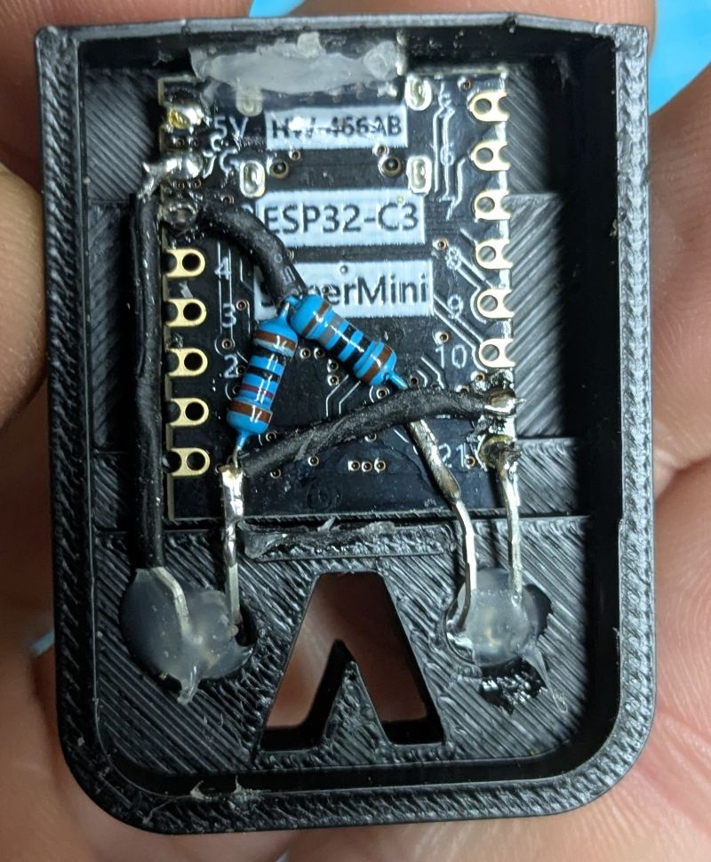
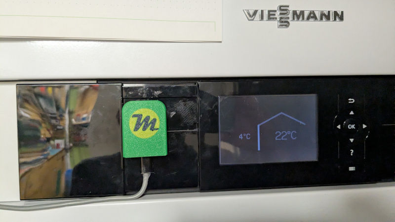

# Viessmann-Waermepumpe-in-ESPhome-with-Optolink-DIY

Connect a Viessmann heat pump via DIY Optolink to Home Assistant (MQTT) using VitoWiFi v3, paced grouped polling, WebSerial, and ElegantOTA.

This README documents the main ESP32‑C3 Arduino sketch in `Vitocal_Optolink-esp32C3/`.

## Project overview

This project uses an ESP32‑C3 (Arduino framework) to connect a DIY Optolink adapter to a Viessmann Vitocal heat pump. Communication to the heat pump is handled by the VitoWiFi v3 library. Home Assistant integration is done via MQTT using ArduinoHA entities defined in `Vitocal_Optolink-esp32C3/HA_mqtt_addin.h`.

The codebase was migrated from older VitoWiFi v2-style datapoints to VitoWiFi v3. Datapoints and polling are grouped, with adjustable intervals from Home Assistant. OTA updates and a lightweight debug console are provided via ElegantOTA and WebSerial on an async web server. Optolink access is paced by allowing only one request in-flight at a time, plus a small gap after each response/error.

### Hardware and Wiring

- **Microcontroller:**
	- ESP32‑C3
- **Optolink link (UART):**
	- ESP32‑C3: Hardware `Serial0` UART0 at 4800 baud, 8E1
		- RX: `GPIO20`
		- TX: `GPIO21`
- **Optolink adapter:** DIY design based on the openv project
	- Base schematic: https://github.com/openv/openv/wiki/Bauanleitung-ESP8266
	- IR send diode: `L-7104SF4BT` (replaces the diode from the reference design)

Notes:
- VitoWiFi initializes and configures the serial port internally via its `begin()`; the sketch does not call `Serial.begin` for Optolink.
- USB serial (`Serial`) is used for boot logs at 115200 baud; Optolink stays on `Serial0`.

The schematic largely follows the openv ESP8266 instructions and typical Optolink transceiver wiring. Ensure the IR transceiver is aligned properly on the Viessmann service port.

### Photos

### Software and Libraries

- **Platform:** Arduino (ESP32 core)
- **Viessmann communication:** `VitoWiFi v3` using the Viessmann “KW” protocol (named “VS1” within VitoWiFi)
- **Home Assistant integration:** MQTT via `ArduinoHA`
- **OTA and web:** `ESP Async WebServer` + `ElegantOTA` (async mode) + `WebSerial`

Notes:
- VitoWiFi v3 renamed and regrouped various datapoints versus v2. This repo uses v3-style datapoints bound via `HA_mqtt_addin.h`.
- Operation and manual mode labels are localized in German (see `HA_mqtt_addin.h`).

### Features

- Reliable two-way communication with the Viessmann Vitocal 343-G via Optolink using VitoWiFi v3 (protocol “VS1”/KW).
- Grouped polling scheduler with HA-adjustable intervals (fast/medium/slow) exposed via `HA_mqtt_addin.h`.
- Default polling intervals: fast 40 s, medium 64 s, slow 180 s (can be changed from Home Assistant).
- Pacing: only one Optolink request in-flight at a time, plus a small response gap after each response/error (default `VITO_RESPONSE_GAP_MS=50`).
- Home Assistant entities (numbers/selects/switches) bound to datapoints and commands.
- Web UI providing ElegantOTA (`/update`) and a WebSerial console (`/webserial`) for debugging.
- German labels for operation modes and manual modes restored for UI consistency.

### Async WebServer, ElegantOTA, and WebSerial
- The project uses `ESP Async WebServer` to avoid blocking the main loop and to serve ElegantOTA and WebSerial endpoints concurrently.
- `ElegantOTA` in async mode requires defining the async build flag: `-DELEGANTOTA_USE_ASYNC_WEBSERVER=1`.
- `WebSerial` provides a browser-based serial console for quick diagnostics; VitoWiFi and app logs can be viewed without a physical USB serial connection.

### Protocol
- Viessmann “KW” protocol is used for communication; in VitoWiFi this protocol is named “VS1”. Ensure VitoWiFi is configured to operate with VS1 when building.

### Build and CI
- Local builds use Arduino IDE/CLI with the necessary compiler flags for ElegantOTA async (`-DELEGANTOTA_USE_ASYNC_WEBSERVER=1`).
- CI is provided via GitHub Actions in `.github/workflows/ci.yml` to verify the ESP32‑C3 build. Tags (e.g., `v0.2.10`, `v0.2.11`) trigger release workflows.

### Security
- Avoid hardcoding credentials in source. This repo uses a `secrets.h` (git-ignored) that defines `WIFI_SSID`, `WIFI_PASSWORD`, `MQTT_USER`, and `MQTT_PASS`. Update `secrets.h` locally with your values.
- Alternatively, consider WiFiManager or runtime configuration for production.
 - A `secrets.example.h` is provided. Copy it to `secrets.h` and set your credentials. The real `secrets.h` is ignored by git.
 - Fallback logic: If `secrets.h` is absent, the sketch automatically includes `secrets.example.h` so CI builds succeed without real credentials.

### Diagnostics
- Home Assistant entities for device health:
	- `vito_error_count`: total errors within a rolling window.
	- `vito_consecutive_errors`: current consecutive error streak.
	- `vito_error_threshold`: configurable consecutive error threshold (default 30; range 1–100).
- When the threshold is reached, the firmware applies a brief backoff (increases poll intervals) and reinitializes VitoWiFi.

### Key Files
- `Vitocal_Optolink-esp32C3/Vitocal_Optolink-esp32C3.ino`: main sketch (WiFi, VitoWiFi init, async web server, OTA/WebSerial, polling loop).
- `Vitocal_Optolink-esp32C3/HA_mqtt_addin.h`: Home Assistant MQTT entities, callbacks, and HA-configurable polling intervals.
- `Vitocal_Optolink-esp32C3/Vitocal_datapoints.h`: VitoWiFi v3 datapoint definitions.
- `Vitocal_Optolink-esp32C3/Vitocal_polling.h`: Polling group state shared across sketch + HA.

### Folder Layout
- Main ESP32‑C3 sketch resides in `Vitocal_Optolink-esp32C3/`.
- Workflows compile the sketch and publish releases for tagged commits.

### Useful Links
- Schematic (generic): https://github.com/openv/openv/wiki/ESPHome-Optolink
- 3D housing (Wemos D1 mini enclosure): https://makerworld.com/de/models/1567595-viessmann-optolink-esp8266-wemos-d1-mini-enclosure#profileId-1648098
- Related documentation:
	- https://github.com/openv/openv/wiki/Bauanleitung-ESP8266
	- https://github.com/openv/openv/wiki/Bauanleitung-LAN-Ethernet
- VitoWiFi project: https://github.com/bertmelis/VitoWiFi

### Getting Started

- Requirements:
	- Arduino IDE or Arduino CLI
	- Libraries: `bertmelis/VitoWiFi` (v3), `arduino-libraries/ArduinoHA`, `me-no-dev/ESP Async WebServer`, `me-no-dev/AsyncTCP` (ESP32), `ayushsharma82/ElegantOTA`, `me-no-dev/WebSerial`
	- Board cores: ESP32 by `Espressif`

- Configure secrets:
	- Copy `secrets.example.h` to `secrets.h` and set `WIFI_SSID`, `WIFI_PASSWORD`, `MQTT_USER`, `MQTT_PASS`.

- Build flags:
	- Define `ELEGANTOTA_USE_ASYNC_WEBSERVER` for async mode.
	- Example (Arduino CLI): `--build-properties compiler.c.extra_flags="-DELEGANTOTA_USE_ASYNC_WEBSERVER=1" compiler.cpp.extra_flags="-DELEGANTOTA_USE_ASYNC_WEBSERVER=1"`

- ESP32‑C3:
	- Open `Vitocal_Optolink-esp32C3/Vitocal_Optolink-esp32C3.ino` and upload to ESP32‑C3.
	- Wiring: Optolink to UART0 (`RX=GPIO20`, `TX=GPIO21`).

- First run:
	- Connect device to WiFi using `secrets.h` values.
	- Visit device IP: ElegantOTA and WebSerial are served on the default web port.
	- Configure polling speeds in Home Assistant via provided entities.
