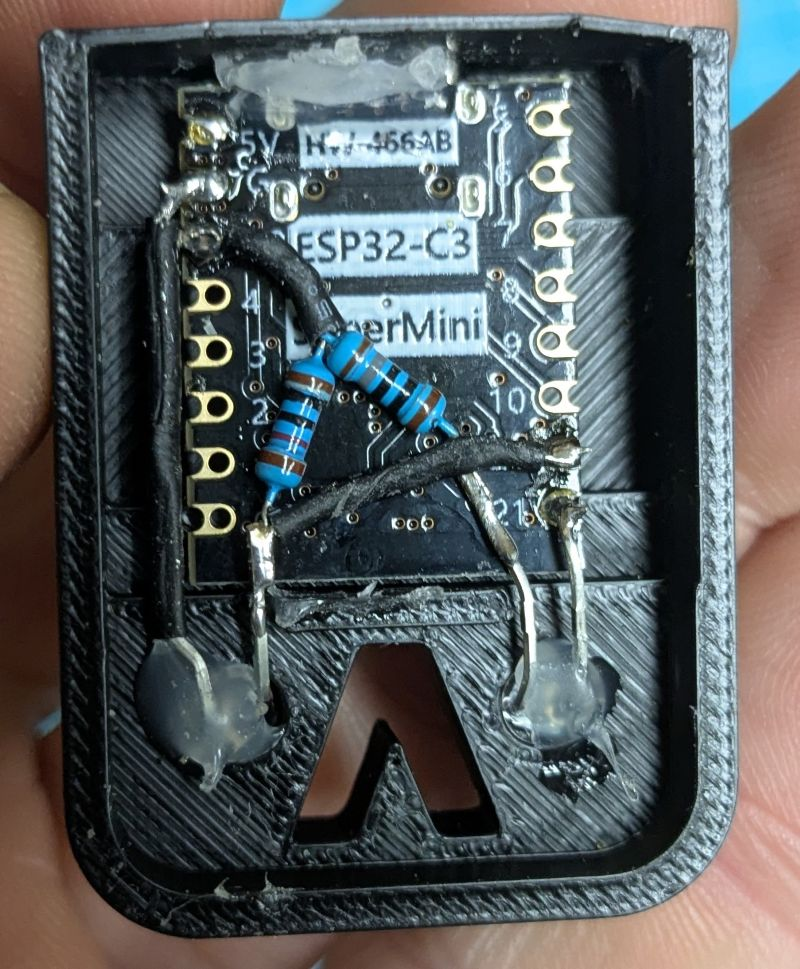
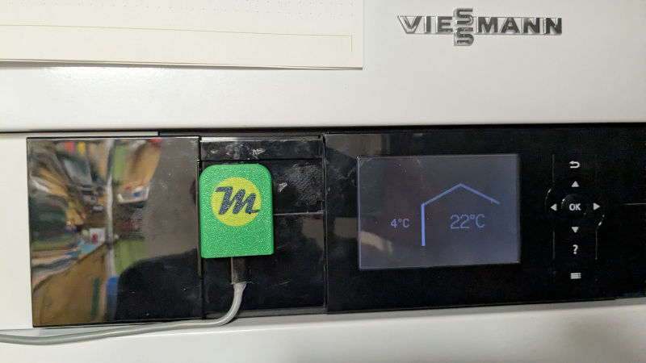

# Viessmann-Waermepumpe-in-ESPhome-with-Optolink-DIY
Connect a Viessmann heat pump via DIY Optolink to Home Assistant (MQTT) using VitoWiFi v3, paced grouped polling, WebSerial, and ElegantOTA.

This README documents the main ESP32‑C3 Arduino sketch in `Vitocal_Optolink-esp32C3/`.

## Project overview

This project uses an ESP32‑C3 (Arduino framework) to connect a DIY Optolink adapter to a Viessmann Vitocal heat pump. Communication to the heat pump is handled by the VitoWiFi v3 library. Home Assistant integration is done via MQTT using ArduinoHA entities defined in `Vitocal_Optolink-esp32C3/HA_mqtt_addin.h`.

**Core Architecture:** Event-driven non-blocking communication using VitoWiFi v3's callback-based API. Datapoints are organized into polling groups (fast/medium/slow) with adjustable intervals. The main loop schedules at most one read request per iteration via `pollVitoGroup(...)`, guarded by `vitoBusy` (one in-flight request only). Writes are prioritized by pausing read polling while a write is pending. Optional debug polling modes can temporarily switch the active polling set.

### Hardware and Wiring

- **Microcontroller:**
	- ESP32‑C3
- **Optolink link (UART):**
	- ESP32‑C3: Hardware `Serial0` UART0 at 4800 baud, 8E1
		- RX: `GPIO20`
		- TX: `GPIO21`
- **Optolink adapter:** DIY design based on the openv project
	- Base schematic: https://github.com/openv/openv/wiki/Bauanleitung-ESP8266
	- IR send diode: `L-7104SF4BT` (replaces the diode from the reference design)

Notes:
- VitoWiFi initializes and configures the serial port internally via its `begin()`; the sketch does not call `Serial.begin` for Optolink.
- USB serial (`Serial`) is used for boot logs at 115200 baud; Optolink stays on `Serial0`.

The schematic largely follows the openv ESP8266 instructions and typical Optolink transceiver wiring. Ensure the IR transceiver is aligned properly on the Viessmann service port.

### Photos

<a href="docs/ESP32C3.jpg"></a>
<a href="docs/device_installed.jpg"></a>
<a href="docs/final%20device.jpg"></a>

### Software and Libraries

- **Platform:** Arduino (ESP32 core)
- **Viessmann communication:** `VitoWiFi v3` using the Viessmann “KW” protocol (named “VS1” within VitoWiFi)
- **Home Assistant integration:** MQTT via `ArduinoHA`
- **OTA and web:** `ESP Async WebServer` + `ElegantOTA` (async mode) + `WebSerial`

Notes:
- VitoWiFi v3 renamed and regrouped various datapoints versus v2. This repo uses v3-style datapoints bound via `HA_mqtt_addin.h`.
- Operation and manual mode labels are localized in German (see `HA_mqtt_addin.h`).

### Features

- Reliable two-way communication with the Viessmann Vitocal 343-G via Optolink using VitoWiFi v3 (protocol “VS1”/KW).
- Grouped polling scheduler with HA-adjustable intervals (fast/medium/slow) exposed via `HA_mqtt_addin.h`.
- Default polling intervals: fast 36 s, medium 60 s, slow 150 s (can be changed from Home Assistant).
- Pacing: only one Optolink request in-flight at a time; software response gap is configurable via `VITO_RESPONSE_GAP_MS` and defaults to `0`.
- Home Assistant entities (numbers/selects/switches) bound to datapoints and commands.
- Web UI providing ElegantOTA (`/update`) and a WebSerial console (`/webserial`) for debugging.
- German labels for operation modes and manual modes restored for UI consistency.
- Write trace logging (`[WRT]`) with queued/success/failed details and request timing.
- Timeout post-check for writes: after a write timeout, the next matching read verifies whether the value was applied.
- Temperature plausibility filter (`-50..120 °C`) to suppress obvious outliers before publishing to HA.
- Debug modes via console/WebSerial commands: `Dfast`, `Deheiz`, `Druntime`, `Ddebug` (auto-off after 5 minutes).

### Async WebServer, ElegantOTA, and WebSerial
- The project uses `ESP Async WebServer` to avoid blocking the main loop and to serve ElegantOTA and WebSerial endpoints concurrently.
- `ElegantOTA` in async mode requires defining the async build flag: `-DELEGANTOTA_USE_ASYNC_WEBSERVER=1`.
- `WebSerial` provides a browser-based serial console for quick diagnostics; VitoWiFi and app logs can be viewed without a physical USB serial connection.

### Protocol
- Viessmann “KW” protocol is used for communication; in VitoWiFi this protocol is named “VS1”. Ensure VitoWiFi is configured to operate with VS1 when building.

### Build and CI
- Local builds use Arduino IDE/CLI with the necessary compiler flags for ElegantOTA async (`-DELEGANTOTA_USE_ASYNC_WEBSERVER=1`).
- CI is provided via GitHub Actions in `.github/workflows/ci.yml` to verify the ESP32‑C3 build. Tags (e.g., `v0.2.10`, `v0.2.11`) trigger release workflows.

### Security
- Avoid hardcoding credentials in source. This repo uses a `secrets.h` (git-ignored) that defines `WIFI_SSID`, `WIFI_PASSWORD`, `MQTT_USER`, and `MQTT_PASS`. Update `secrets.h` locally with your values.
- Alternatively, consider WiFiManager or runtime configuration for production.
 - A `secrets.example.h` is provided. Copy it to `secrets.h` and set your credentials. The real `secrets.h` is ignored by git.
 - Fallback logic: If `secrets.h` is absent, the sketch automatically includes `secrets.example.h` so CI builds succeed without real credentials.

### Diagnostics
- Home Assistant entities for device health:
	- `vito_error_count`: total errors within a rolling window.
	- `vito_consecutive_errors`: current consecutive error streak.
	- `vito_error_threshold`: configurable consecutive error threshold (default 30; range 1–100).
- When the threshold is reached, the firmware applies a brief backoff (increases poll intervals) and reinitializes VitoWiFi.
- A rolling 10-minute diagnostics window tracks timeout and sanity-drop counts and prints them in `[DBG]` output.

### Debug commands (USB serial + WebSerial)

- `Dfast`: poll only the small debug group (`dpWWoben`, `dpTempWWSoll`).
- `Deheiz`: poll only `dpRelEHeizStufe1` and `dpRelEHeizStufe2` in sequence (10 s round interval).
- `Druntime`: print loop runtime stats every 2 seconds.
- `Ddebug`: enable detailed per-datapoint `[RSP]` logs.

For `Deheiz`/`Ddebug` output, electric heater values are logged as `raw1/raw2`, decoded `on1/on2` (LSB-based), and `stageCode`.

`stageCode` mapping (VS1):
- `0`: OFF (`raw1=2`, `raw2=2`)
- `1`: Stage 1 (~2.9 kW, `raw1=1`, `raw2=2`)
- `2`: Stage 2 (~5.8 kW, `raw1=2`, `raw2=1`)
- `3`: Stage 3 (~8.8 kW, `raw1=1`, `raw2=1`)

All debug modes auto-disable after 5 minutes.

### Communication Mechanism: Reading and Writing

#### Event-Driven Non-Blocking Architecture

This code implements **event-driven, non-blocking communication** using VitoWiFi v3's callback-based API.

#### Reading (Polling Cycle)

The read cycle operates in three priority-ordered groups with configurable intervals:

1. **Fast Group** (default 36s): relays, pumps, compressor status
2. **Medium Group** (default 60s): temperatures, heating modes
3. **Slow Group** (default 150s): setpoints, hysteresis, heating curve

**Flow for each read:**

```
User loop()
  ↓
Check pending deferred write retry (if any)
  ↓
If no write pending: try at most one read this loop
  - debug modes first (if active), otherwise fast → medium → slow
  ↓
pollVitoGroup() checks: busy flag, optional response gap, group interval
  ↓
vitoWIFI.read() returns bool:
  - true: request queued, set vitoBusy=true, store in-flight datapoint/timestamp
  - false: not queued now; retry in a later loop
  ↓
vitoWIFI.loop() dispatches onVitoResponse()/onVitoError()
  ↓
Callbacks clear busy/pending flags, decode/publish values, and emit logs
```

**Key characteristics:**
- Only one request in-flight at a time (`vitoBusy` flag prevents concurrent requests)
- Optional software response gap between requests (`VITO_RESPONSE_GAP_MS`, default 0)
- Each polling group tracks its own interval timer and datapoint index
- If a read returns `false`, the same datapoint remains queued for a later retry
- Polling starts automatically from the main loop after `setup()`

**Compliance with VitoWiFi v3:**
- ✅ `vitoWIFI.loop()` called every iteration (required for internal state machine and callback dispatch)
- ✅ `vitoWIFI.read()` return values checked (bool indicates queue success)
- ✅ Callbacks attached before `vitoWIFI.begin()`
- ✅ Timing handled by application (no blocking)

#### Writing (Command Handling)

Writes are initiated by Home Assistant entities (numbers, select, climate) via MQTT callbacks in `HA_mqtt_addin.h`.

**Flow for each write:**

```
Home Assistant user sets setpoint (e.g., room temperature)
  ↓
MQTT command arrives
  ↓
ArduinoHA routes to callback (e.g., onTargetTemperatureCommand)
  ↓
Callback validates and tries `vitoWIFI.write(datapoint, value)`
  ↓
vitoWIFI.write() returns bool:
  - true: write queued now, set `vitoWritePending=true`
  - false: request is deferred (`pendingWrite*`), retried every 250 ms
  ↓
When write is pending, normal read polling is paused (write priority)
  ↓
onVitoResponse()/onVitoError() logs `[WRT]` success/failure and clears pending state
  ↓
If timeout occurred, firmware arms a post-timeout verify and checks next matching read
```

**Write operations:**
- `setRaumSoll()` — room temperature setpoint
- `setRaumSollRed()` — reduced room temperature setpoint  
- `setWWSoll()` — domestic hot water (DHW) setpoint 1
- `setWWSoll2()` — DHW setpoint 2 (optional mode)
- `setHystWWsoll()` — DHW hysteresis
- `setHKneigung()` — heating curve slope
- `setHKniveau()` — heating curve offset
- `onTargetTemperatureCommand()` — HVAC climate control
- `onManualModeCommand()` — manual mode select

**Write Priority Mechanism:**
- `vitoWritePending` pauses regular read polling while a write is in flight.
- Deferred writes (`pendingWrite*`) are retried non-blocking every 250 ms until queued.
- `markWriteQueued(...)` stores expected value and timing for trace logs.
- `[WRT]` logs include queue/success/failure state and request duration (`Δreq`).
- On timeout, a post-timeout verification compares the next matching read against expected value.

**Error Handling:**
- If immediate write queuing fails, the firmware defers and retries automatically.
- Communication errors are counted (rolling window + consecutive count) and published to HA.
- After too many consecutive errors, polling is backed off briefly and VitoWiFi is reinitialized.

### Performance Notes

- Request/response timing is measured per request and logged as `req=... ms` / `Δreq=... ms`.
- Throughput depends on heat pump response latency and selected polling intervals.
- Debug modes (`Dfast`, `Deheiz`, `Druntime`, `Ddebug`) are intended for diagnostics and temporarily alter normal polling behavior.

### Home Assistant entities

All entities are created via MQTT discovery using the `wp_` prefix (see `Vitocal_Optolink-esp32C3/HA_mqtt_addin.h`).

Note: Home Assistant will display a human-friendly name (e.g. “Aussentemperatur”), but the underlying `entity_id`/`object_id` comes from the IDs listed below (unless you rename them in HA).

| Entity ID | Type | Description |
| --- | --- | --- |
| `wp_Aussentemperatur` | sensor | Outside temperature (°C). |
| `wp_WarmwasserOben` | sensor | Domestic hot water temperature (top) (°C). |
| `wp_VorlaufSoll` | sensor | Heating flow temperature setpoint (°C). |
| `wp_Vorlauf` | sensor | Heating flow temperature actual (°C). |
| `wp_Ruecklauf` | sensor | Heating return temperature (°C). |
| `wp_EHeizstufe` | sensor | Electric heater stage code (0=OFF, 1=Stage1, 2=Stage2, 3=Stage3). |
| `wp_Heizkreispumpe` | binary_sensor | Heating circuit pump running. |
| `wp_WWZirkulation` | binary_sensor | Hot water circulation pump running. |
| `wp_VentilHeizenWW` | sensor | Valve state “heating vs DHW” (text). |
| `wp_Verdichter` | binary_sensor | Compressor running. |
| `wp_Grundwasserpumpe` | binary_sensor | Primary source pump running (groundwater). |
| `wp_Sekundaerpumpe` | binary_sensor | Secondary pump running. |
| `wp_WPStoerung` | binary_sensor | Heat pump fault active. |
| `wp_Waermepumpe` | climate | HVAC-like control (target temperature + mode). |
| `wp_WarmwasserSoll` | number | DHW temperature setpoint 1 (°C). |
| `wp_WarmwasserSoll2` | number | DHW temperature setpoint 2 (°C). |
| `wp_Raumtemperatur` | number | Room temperature setpoint (°C). |
| `wp_RaumtemperaturRed` | number | Reduced room temperature setpoint (°C). |
| `wp_HystereseWWsoll` | number | DHW setpoint hysteresis (°C). |
| `wp_NeigungHeizkennlinie` | number | Heating curve slope (0–1). |
| `wp_NiveauHeizkennlinie` | number | Heating curve offset/level (K). |
| `wp_Betriebsmodus` | sensor | Current operation mode (text). |
| `wp_ManualMode` | sensor | Current manual mode (text). |
| `wp_setManualMode` | select | Set manual mode (normal / manual / 1× DHW to temp2). |
| `wp_fastPollInterval` | number | Fast polling interval (s). |
| `wp_mediumPollInterval` | number | Medium polling interval (s). |
| `wp_slowPollInterval` | number | Slow polling interval (s). |
| `wp_vito_error_count` | sensor | VitoWiFi error counter (rolling window). |
| `wp_vito_consecutive_errors` | sensor | Consecutive VitoWiFi errors. |
| `wp_vito_error_threshold` | number | Error threshold before backoff/re-init (1–100). |

### Heating curve (Heizkennlinie)

For the Vitocal 343‑G with Vitotronic 200 WO1C, the service manual diagrams show a heating curve that can be modeled as a line around a fixed point:

- At outdoor temperature `T_out = 20 °C`, the curve meets `T_flow = 20 °C` (for the default “normal room setpoint = 20 °C”, “niveau = 0”).
- `wp_NeigungHeizkennlinie` changes the slope (steepness).
- `wp_NiveauHeizkennlinie` shifts the curve up/down (parallel shift).
- The normal room temperature setpoint shifts the curve along the “room setpoint” axis.

A practical formula that matches those properties is:

```
T_flow_set = T_room_set + niveau + neigung * (T_room_set - T_out)
```

Where:
- `T_out` = `sensor.wp_aussentemperatur` (°C)
- `T_room_set` = `number.wp_raumtemperatur_soll` (°C) (or `number.wp_raumtemperatur_red_soll` for reduced)
- `neigung` = `number.wp_neigung_heizkennlinie` (dimensionless)
- `niveau` = `number.wp_niveau_heizkennlinie` (K; numerically same as °C offset)

#### Home Assistant: calculated flow setpoint

Add a calculated sensor in Home Assistant to validate/visualize the curve against the real setpoint (`sensor.wp_vorlaufsoll`). Example for `configuration.yaml`:

```yaml
template:
  - sensor:
      - name: "WP Heizkennlinie VorlaufSoll (berechnet)"
        unique_id: wp_heizkennlinie_vorlaufsoll_berechnet
        unit_of_measurement: "°C"
        state: >
          
          
          
          
          
            unknown
          
            {{ (t_room + niveau + slope * (t_room - t_out)) | round(1) }}
          

      - name: "WP VorlaufSoll Abweichung (Ist - berechnet)"
        unique_id: wp_vorlaufsoll_abweichung
        unit_of_measurement: "°C"
        state: >
          
          
          
            unknown
          
            {{ (actual - calc) | round(1) }}
          
```

#### Home Assistant: curve chart (optional)

If you want to plot the curve as a graph in a dashboard, a convenient option is the custom Lovelace `apexcharts-card`.

Example Lovelace card (add via Dashboard → Edit → Manual card). This plots the calculated curve and overlays the current operating point:

```yaml
type: custom:apexcharts-card
header:
  show: true
  title: Heizkennlinie (Vorlauf vs. Außentemperatur)
graph_span: 1d
span:
  start: day
apex_config:
  xaxis:
    type: numeric
    title:
      text: Außentemperatur (°C)
    min: -30
    max: 20
  markers:
    # markers.size can be an array (per-series). We hide markers on the curve,
    # but show them for the 2 single-point “Aktuell …” series.
    size: [0, 6, 6]
  yaxis:
    title:
      text: Vorlauf (°C)
series:
  - name: Kennlinie (berechnet)
    type: line
    entity: sensor.wp_aussentemperatur
    stroke_width: 2
    show:
      legend_value: false
    data_generator: |
      // Note: apexcharts-card v2.2.x requires `entity` in each series.
      // We use it only as an update trigger; the actual points come from this generator.
      const tRoom = parseFloat(hass.states['number.wp_raumtemperatur_soll']?.state);
      const slope = parseFloat(hass.states['number.wp_neigung_heizkennlinie']?.state);
      const niveau = parseFloat(hass.states['number.wp_niveau_heizkennlinie']?.state);
      if ([tRoom, slope, niveau].some(v => Number.isNaN(v))) return [];

      const points = [];
      for (let tOut = -30; tOut <= 20; tOut += 1) {
        const tFlow = tRoom + niveau + slope * (tRoom - tOut);
        points.push([tOut, Math.round(tFlow * 10) / 10]);
      }
      return points;

  - name: Aktuell (VorlaufSoll)
    type: line
    entity: sensor.wp_vorlaufsoll
    stroke_width: 0
    show:
      legend_value: false
    data_generator: |
      const tOut = parseFloat(hass.states['sensor.wp_aussentemperatur']?.state);
      const tFlow = parseFloat(hass.states['sensor.wp_vorlaufsoll']?.state);
      if ([tOut, tFlow].some(v => Number.isNaN(v))) return [];
      return [[tOut, tFlow]];

  - name: Aktuell (berechnet)
    type: line
    entity: sensor.wp_heizkennlinie_vorlaufsoll_berechnet
    stroke_width: 0
    show:
      legend_value: false
    data_generator: |
      const tOut = parseFloat(hass.states['sensor.wp_aussentemperatur']?.state);
      const tFlow = parseFloat(hass.states['sensor.wp_heizkennlinie_vorlaufsoll_berechnet']?.state);
      if ([tOut, tFlow].some(v => Number.isNaN(v))) return [];
      return [[tOut, tFlow]];
```

### Key Files
- `Vitocal_Optolink-esp32C3/Vitocal_Optolink-esp32C3.ino`: main sketch (WiFi, VitoWiFi init, async web server, OTA/WebSerial, polling loop).
- `Vitocal_Optolink-esp32C3/HA_mqtt_addin.h`: Home Assistant MQTT entities, callbacks, and HA-configurable polling intervals.
- `Vitocal_Optolink-esp32C3/Vitocal_datapoints.h`: VitoWiFi v3 datapoint definitions.
- `Vitocal_Optolink-esp32C3/Vitocal_polling.h`: Polling group state shared across sketch + HA.

### Folder Layout
- Main ESP32‑C3 sketch resides in `Vitocal_Optolink-esp32C3/`.
- Workflows compile the sketch and publish releases for tagged commits.

### Useful Links
- Schematic (generic): https://github.com/openv/openv/wiki/ESPHome-Optolink
- 3D housing (Wemos D1 mini enclosure): https://makerworld.com/de/models/1567595-viessmann-optolink-esp8266-wemos-d1-mini-enclosure#profileId-1648098
- Related documentation:
	- https://github.com/openv/openv/wiki/Bauanleitung-ESP8266
	- https://github.com/openv/openv/wiki/Bauanleitung-LAN-Ethernet
- VitoWiFi project: https://github.com/bertmelis/VitoWiFi

### VitoWiFi v3 API Compliance

This implementation follows the VitoWiFi v3 non-blocking API:

| Requirement | Implementation | Status |
| --- | --- | --- |
| **Call `loop()` regularly** | `vitoWIFI.loop()` called every iteration of main `loop()` | ✅ |
| **Attach callbacks before `begin()`** | `onResponse()` and `onError()` attached in `setup()` | ✅ |
| **Check `read()` return value** | `pollVitoGroup()` checks if `vitoWIFI.read()` returns true | ✅ |
| **Check `write()` return value** | All write callbacks (`setRaumSoll()`, etc.) check return value | ✅ |
| **Handle callback dispatch from `loop()`** | Callbacks execute in `loop()` context when requests complete | ✅ |
| **No blocking calls** | Event-driven scheduling; all I/O non-blocking | ✅ |

**Architecture Note:** This implementation is fully non-blocking and callback-driven, with one in-flight Optolink request at a time and loop-based grouped polling.

### Getting Started

- Requirements:
	- Arduino IDE or Arduino CLI
	- Libraries: `bertmelis/VitoWiFi` (v3), `arduino-libraries/ArduinoHA`, `me-no-dev/ESP Async WebServer`, `me-no-dev/AsyncTCP` (ESP32), `ayushsharma82/ElegantOTA`, `me-no-dev/WebSerial`
	- Board cores: ESP32 by `Espressif`

- Configure secrets:
	- Copy `secrets.example.h` to `secrets.h` and set `WIFI_SSID`, `WIFI_PASSWORD`, `MQTT_USER`, `MQTT_PASS`.

- Build flags:
	- Define `ELEGANTOTA_USE_ASYNC_WEBSERVER` for async mode.
	- Example (Arduino CLI): `--build-properties compiler.c.extra_flags="-DELEGANTOTA_USE_ASYNC_WEBSERVER=1" compiler.cpp.extra_flags="-DELEGANTOTA_USE_ASYNC_WEBSERVER=1"`

- ESP32‑C3:
	- Open `Vitocal_Optolink-esp32C3/Vitocal_Optolink-esp32C3.ino` and upload to ESP32‑C3.
	- Wiring: Optolink to UART0 (`RX=GPIO20`, `TX=GPIO21`).

- First run:
	- Connect device to WiFi using `secrets.h` values.
	- Visit device IP: ElegantOTA and WebSerial are served on the default web port.
	- Configure polling speeds in Home Assistant via provided entities.
